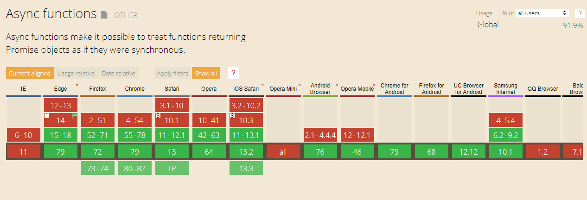
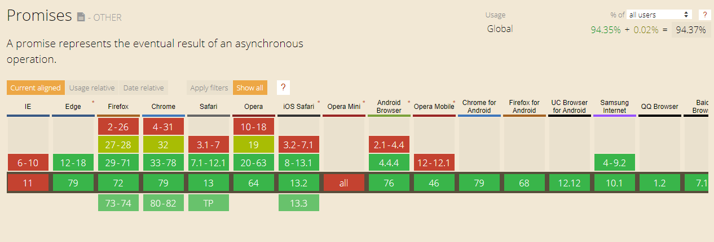

# AJAX | 非同步的JavaScript與XML技術

> Asynchronous JavaScript and XML

AJAX 使用 XMLHttpRequest 物件來與伺服器進行通訊

<br />

**what is XML?**

XML | 可延伸標記式語言

> Extensible Markup Language

```xml
<?xml version="1.0" encoding="UTF-8"?>
<note>
  <to>Tove</to>
  <from>Jani</from>
  <heading>Reminder</heading>
  <body>Don't forget me this weekend!</body>
</note>
```

<br />

## HTTP Request

<br />

## AJAX

```javascript
function loadDoc() {
  var xhttp = new XMLHttpRequest();
  xhttp.onreadystatechange = function() {
    if (this.readyState == 4 && this.status == 200) {
     document.getElementById("demo").innerHTML = this.responseText;
    }
  };
  xhttp.open("GET", "ajax_info.txt", true);
  xhttp.send();
}
```

<br />

### async await 和 promise 的關係

**async**

當 async 函式被呼叫時，它會回傳一個 Promise。

如果該 async 函式回傳了一個值，Promise 的狀態將為一個帶有該回傳值的 resolved。

如果 async 函式拋出例外或某個值，Promise 的狀態將為一個帶有被拋出值的 rejected。

```js
function wait(ms) {
  return new Promise(r => setTimeout(r, ms));
}

// sequential
async function series() {
  await wait(500); // Wait 500ms…
  await wait(500); // …then wait another 500ms.
  console.log("series done!");
}

// parallel
async function parallel() {
  const wait1 = wait(500); // Start a 500ms timer asynchronously…
  const wait2 = wait(500); // …meaning this timer happens in parallel.
  await wait1;             // Wait 500ms for the first timer…
  await wait2;             // …by which time this timer has already finished.
  console.log("parallel done!");
}
```

<br />



<br />

**Promise**

<br />



**Promise polyfill**
```html
<script src="https://cdn.jsdelivr.net/npm/promise-polyfill@8/dist/polyfill.min.js"></script>
```

**用 Promise 做延遲 3秒後執行**

```js
var promise1 = new Promise((resolve, reject) => {
  setTimeout(()=> {
    resolve('done');
  }, 3000);
});

promise1.then(value=> {
  console.log(value);
});

console.log(promise1);
```

<br />

### Fetch API

```js
fetch(url, options).then(function(response) {
  // handle HTTP response
}, function(error) {
  // handle network error
})

// options
fetch(url, {
  method: "POST",
  body: JSON.stringify(data),
  headers: {
    "Content-Type": "application/json"
  },
  credentials: "same-origin"
}).then(function(response) {
  response.status     //=> number 100–599
  response.statusText //=> String
  response.headers    //=> Headers
  response.url        //=> String

  return response.text()
}, function(error) {
  error.message //=> String
})
```


<br />

## JQuery AJAX

```javascript
$.ajax("URL_STRING");
```

```javascript
$.ajax({
  url: "URL_STRING",
  dataType: "DATATYPE"
}).done(SUCCESS_CALLBACK)
  .fail(FAIL_CALLBACK);
```

<br />

### JQuery Deferred

延遲執行 callback，可串接多個任務

用來處理非同步的事件

**JQuery.when()**

```js
function a() {
  var deferred = $.Deferred();
  setTimeout(function() {
    deferred.resolve("a done");
  }, 1000);
  return deferred.promise();
}

function b() {
  var deferred = $.Deferred();
  setTimeout(function() {
    deferred.resolve("b done");
  }, 3000);
  return deferred.promise();
}

$.when(a(), b()).done(function(res1, res2) {
  console.log(res1); // a done
  console.log(res2); // b done
})
```

**handle error**

```js
function a() {
  var deferred = $.Deferred();
  setTimeout(function() {
    deferred.resolve("a done");
  }, 1000);
  return deferred.promise();
}

function b() {
  var deferred = $.Deferred();
  setTimeout(function() {
    deferred.reject("b fail");
  }, 3000);
  return deferred.promise();
}

$.when(a(), b()).done(function(res1, res2) {
  console.log(res1);
  console.log(res2);
}).fail(function(error) {
  console.error(error); // b fail
});
```

<br />

**狀態**

pending

done | success

fail | error

<br />

<b>promise</b>

Deferred 的簡化，少了設定狀態的方法，以防止被變更狀態

<br />

### JQuery xml error 

**No Access-Control-Allow-Origin' header is present on the requested resource**

http://stackoverflow.com/questions/19821753/jquery-xml-error-no-access-control-allow-origin-header-is-present-on-the-req

the same-origin policy says that browsers should only allow ajax calls to services at the same domain of the HTML page.

<br />

## ES6 AJAX

<br />

## HTTP Status Code

1xx 訊息

2xx 成功

3xx 重新導向

4xx 用戶端錯誤

5xx 伺服器錯誤

<br />

### 待研究

- [ ] AJAX 原理?
- [ ] headers 的用意
