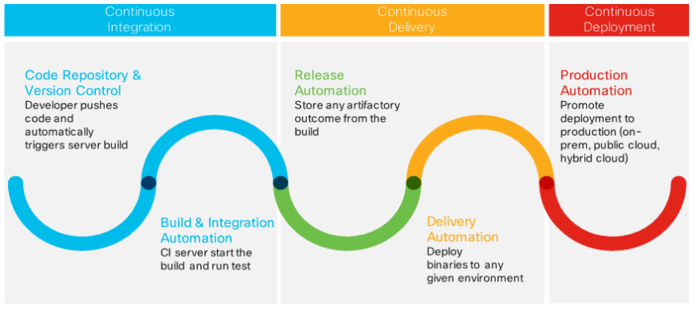
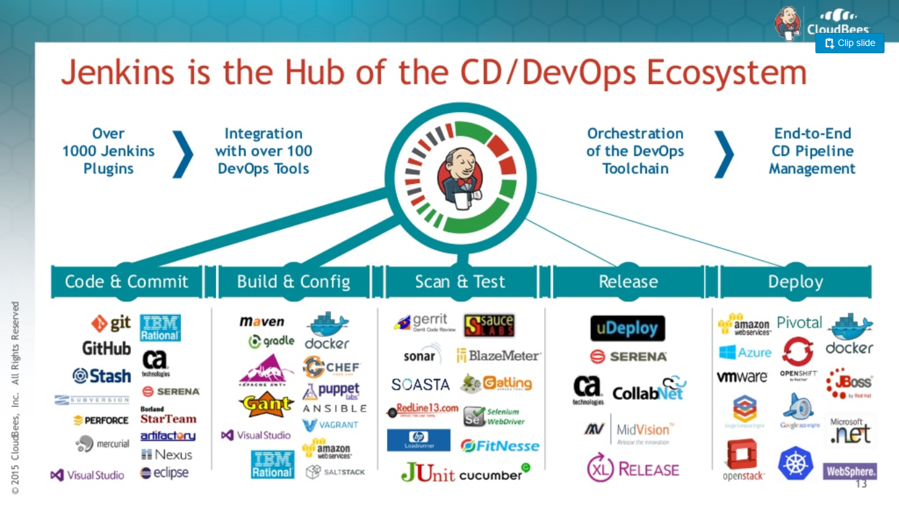
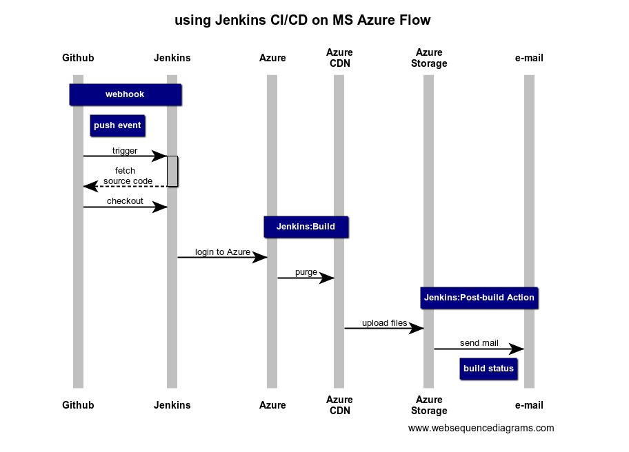

# Jenkins Test


Azure Storage | Azure CDN
------------- | ---------
[URL](https://cs12f2ef59c887ax4755xb5a.blob.core.windows.net/web01/jenkins_build/index.html) | [URL](https://jenkins-cdn.azureedge.net/jenkins_build/index.html)

[Jenkins Dashboard](http://jenkins001.southeastasia.cloudapp.azure.com/job/webhook-pipeline/)

[Pipeline(blue theme)](http://jenkins001.southeastasia.cloudapp.azure.com/blue/organizations/jenkins/webhook-pipeline/activity)

<br />

### Jenkins 是什麼?

構建 CI/CD 的自動化部署工具

- **CI** | Continuous Integration (持續整合)

- **CD** | Continuous Delivery (持續交付)

- **CD** | Continuous Deployment (持續部署)



reference: [Have You Ever Considered CI/CD as a Service?](https://blogs.cisco.com/cloud/have-you-ever-considered-ci-cd-as-a-service)

<br />

### Jenkins 能做什麼?



reference: [Master Continuous Delivery with CloudBees Jenkins Platform](https://www.slideshare.net/dcjuengst/cloudbeesjenkinsplatform2016)

<br />

### 將 Jenkins 部署在 Azure 上



<br />

### Jenkins 建置

[手把手教你搭建Jenkins+Github持续集成环境](https://github.com/muyinchen/woker/blob/master/%E9%9B%86%E6%88%90%E6%B5%8B%E8%AF%95%E7%8E%AF%E5%A2%83%E6%90%AD%E5%BB%BA/%E6%89%8B%E6%8A%8A%E6%89%8B%E6%95%99%E4%BD%A0%E6%90%AD%E5%BB%BAJenkins%2BGithub%E6%8C%81%E7%BB%AD%E9%9B%86%E6%88%90%E7%8E%AF%E5%A2%83.md)

[A tutorial about Continuous Integration and Continuous Delivery by Dockerize Jenkins Pipeline](https://github.com/hakdogan/jenkins-pipeline)

[Jenkins - Pipeline as Code - Slack Notifier](https://ithelp.ithome.com.tw/articles/10203905)

<br />

### Note

- 構建 java app 時, 要先在 Jenkins 內裝好 packages

  ```sh
  $ sudo apt-get install -y openjdk-7-jdk
  $ sudo apt-get install -y maven
  $ sudo apt-get install -y zip unzip
  ```

<br />

- 排程格式
  ```
  * * * * *
  ```

   1.分 (MINUTE)：0–59 分
   
   2.時 (HOUR)： 0–23 時
   
   3.日 (DOM)： 1–31 日
   
   4.月 (MONTH)：1–12 月
   
   5.星期 (DOW)：星期 0–7 （其中 0 與 7 都代表星期天）
 
   可設 H 當做隨機值, 後面接上範圍, 例: H H(10-12) * * * | 早上10點~12點的任何分鐘執行
 
   設定時區：
 
   ```sh
   TZ=Asia/Taipei
   # This job needs to be run in the morning, Taipei time
   ```
 
 <br />
 
 ### Jenkins Plugin
 
 - [Publish Over FTP](https://wiki.jenkins.io/display/JENKINS/Publish+Over+FTP+Plugin)
 
 - [Azure App Service](https://jenkins.io/doc/pipeline/steps/azure-app-service/)
  
 - [Azure CLI](https://wiki.jenkins.io/display/JENKINS/Azure+CLI+Plugin)
 
 - [Azure Storage](https://github.com/jenkinsci/windows-azure-storage-plugin)
 
  - [Embeddable Build Status](https://github.com/jenkinsci/embeddable-build-status-plugin)
  
  - [Slack Notification](https://plugins.jenkins.io/slack)
 
 <br />
 
### 各種疑難雜症

- 若取得 initialAdminPassword 遇到 Permission denied, 加上 `sudo`:

  `sudo` cat /var/lib/jenkins/secrets/initialAdminPassword
  
<br />

- 建置失敗

  ```cmd
  [free style 1] $ sh -xe C:\WINDOWS\TEMP\jenkins6616215853857294425.sh
  The system cannot find the file specified
  FATAL: 指令執行失敗
  java.io.IOException: CreateProcess error=2, 系統找不到指定的檔案。
      at java.lang.ProcessImpl.create(Native Method)
      at java.lang.ProcessImpl.<init>(Unknown Source)
      at java.lang.ProcessImpl.start(Unknown Source)
  ...
  ```

  **solution**

  [Cannot run program “sh”](https://stackoverflow.com/questions/15135771/hudson-on-windows-error-java-io-ioexception-cannot-run-program-sh)

  This is happens because Jenkins is not aware about the shell path.

  In Manage Jenkins -> Configure System -> Shell, set the shell path as
  ```
  C:\Windows\system32\cmd.exe
  ```

<br />

- linux Runtime 'java|1.8|Tomcat|8.5' is not supported.Please invoke 'list-runtimes' to cross check

  ```sh
  az webapp create --name yourWebAppName 
                   --resource-group yourWebAppAzureResourceGroupName
                   --plan yourLinuxAppServicePlanName 
                   --runtime "TOMCAT|8.5-jre8" 
  ```

<br />

- 無法寄出信件

  ```
  javax.mail.AuthenticationFailedException: ...
  ```

  **solution**

  [Jenkins SMTP Email configuration fails verification](https://stackoverflow.com/questions/25718290/jenkins-smtp-email-configuration-fails-verification)

  enable your device with this url: g.co/allowaccess

<br />

### 名詞解釋

- **SCM** | Source Code Management

  Gitlab, Bitbucket...
  
<br />

### 可行性研究

- [x] 如何透過 webhook 自動部署?

- [x] github 上的 build status 是如何做的? [example](https://github.com/microsoft/Terminal)

  shield.io, Embeddable Build Status
  
- [x] 建置完成後, 寄 mail 通知

- [x] 可以設排程做自動化部署? 
  > jenkins 設定 定期建置 > 排程

- [x] 部署完成後, 清 cdn cache? 
  > 透過 azure cli purge, 自己建一個 cdn 測試, jenkins 用 azure upload storage plugin

- [x] 接 slack

- [x] 加上 Blue Ocean UI

- [x] ssh 如何指定 rsa key? 
  > 將不同電腦的public key, 加到 jenkins server 上，或用 ssh config 為不同網站用不同的 ssh key
  
- [x] 將目前的 CI/CD 流程改成 pipieline
  - using webhook to trigger pipeline
  - gin to azure
  - upload to storage
  - purge cdn
  - post build notifications to a slack channel
    - add duration
    - add trigger user
    - dynamic build status

- [ ] 將檔案部署到不同的位置

- [ ]  接自動化測試流程?

- [x] jenkins 變數使用

- [x] shell script 及 groovy 語法

- [ ] 刪除 branch 時通知 (push event?)

- [ ] 用 azureWebAppPublish deploy, 但 web 內容未更新? [Azure App Service Plugin](https://jenkins.io/doc/pipeline/steps/azure-app-service/)

- [ ] azure 上需要 ssh -L 連接, 有其他方式? (using SSL?)
