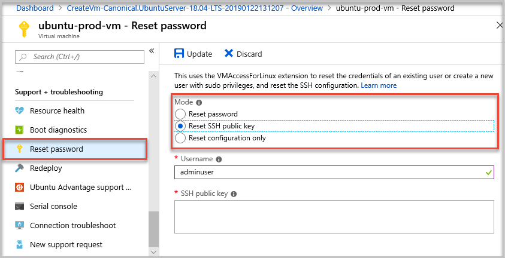

# Azure

## 將 Azure 上的 Jenkins Server 重設 ssh public key

在 vm 上 支援與疑難排解 > 重設密碼 > 重設 SSH 公開金鑰



要將多台電腦的 public key 加到 jenkins server

路徑: `/home/USERNAME/.ssh/authorized_keys`

## Azure CLI

### 將多個檔案傳到 blob storage

[az storage blob upload-batch](https://docs.microsoft.com/en-us/cli/azure/storage/blob?view=azure-cli-latest#az-storage-blob-upload-batch)

```sh
az storage blob upload-batch --destination <container>
                               # The blob container where the files will be uploaded
                             --source <directory> 
                               # The directory where the files to be uploaded are located
                             --account-name <account-name>
                             --account-key <account-key>
                             --destination-path <path>
                               # The destination path that will be appended to the blob name
                             --pattern <pattern>
                               # for globbing files ex: *.js
                             
                             
                             
```

### 建立服務主體

[使用 Jenkins 持續整合和部署從 GitHub 部署至 Azure App Service](https://docs.microsoft.com/zh-tw/azure/jenkins/tutorial-jenkins-deploy-web-app-azure-app-service)

```
az ad sp create-for-rbac --name "yourAzureServicePrincipalName" --password yourSecurePassword
```

### CDN purge

[az cdn endpoint purge](https://docs.microsoft.com/en-us/cli/azure/cdn/endpoint?view=azure-cli-latest#az-cdn-endpoint-purge)

```sh
az cdn endpoint purge -g <resource-group>
                      -n <endpoint>
                        # Name of the CDN endpoint
                      --profile-name <endpoint>
                        # Name of the CDN profile which is unique within the resource group
                      --content-paths <path>
                        # The path to the content to be purged.
                        # ex: \'/web01/build/*\'
```

