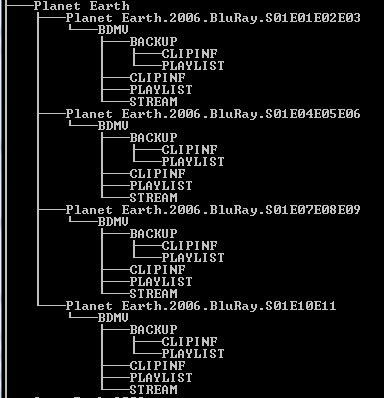

# Command Line

<br />

## create file

```
$ touch FILENAME

$ touch app.html
```

<br />

## Delete

### delete file

rm (remove)

-r (recursive) 刪除目錄

-f (force)

```
$ rm -f FILENAME

$ rm -f app1.html app2.html
```

### delete folder

```
$ rm -rf FOLDER_NAME

$rm -rf app
```

<br />

## Copy

cp (copy)

```
$ cp ORIGIN_FILE TARGET_FOLDER

$ cp app.js /app2/src/
```

<br />

## find files

```
$ find . -name file.txt
find /images -name *.jpg
```

<br />

## nohup

no-hup，hup指的是SIGHUP（hangup)這個信號，nohup就是忽略SIGHUP這個信號的意思。

當我們從一個連線登出的時候，每個process都會收到一個SIGHUP信號，透過nohup所下達的命令就可以不受影響，繼續執行。

& 為背景執行

```
$ nohup your_command &
```

## tree

列出檔案樹狀結構
/f = files
```
tree /f
```


[Tree Command](https://jpsoft.com/help/tree.htm)
