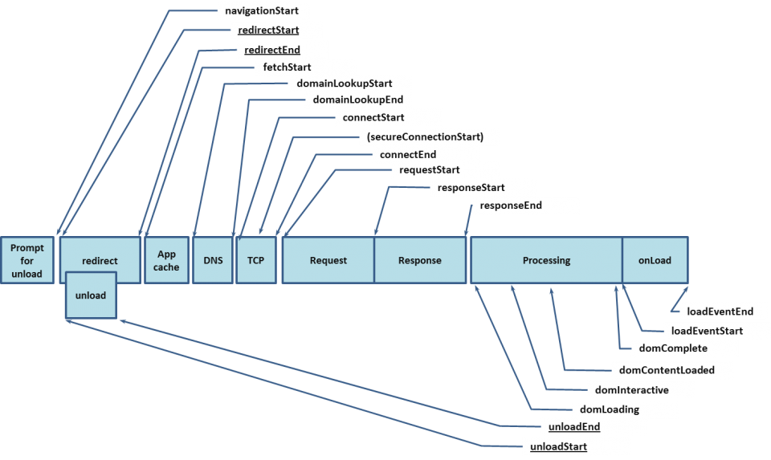
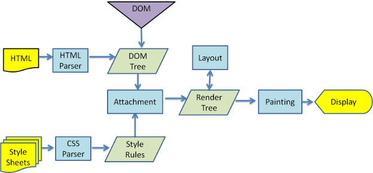

# Browser

### ETag | 實體標籤

> HTTP entity tag

### Cache Control

Cache-Control: max-age=[delta-seconds]

 

## Location

### URL
`http://www.sample.com:8080/campaign/index.html`

**hostname | domain Name**

location.hostname = `www.sample.com`

**host (含 port number)**

location.host = `www.sample.com:8080`

**pathname | 路徑名**

location.pathname = `/campaign/index.html`

 

# Network

瀏覽器處理使用者請求的過程

重定向 -> 檢查瀏覽器暫存 -> DNS 查詢 -> 建立 TCP 連結 -> 發出請求 -> 接收響應 -> 處理 HTML 元素 -> 元素載入完成

 

## Domain Name | 域名

是網路上某一台電腦或電腦組的名稱，由一串用點分隔的名字組成

 

### DNS | 網域名稱系統
> Domain Name System

* 域名->IP 轉換
* 是分散式資料庫

www.wikipedia.org  --> DNS --> 208.80.152.2

域名  --> DNS -->IP位置

 

## 瀏覽器渲染過程

 

## Reference

[瀏覽器處理使用者請求的過程 & 效能優化](https://www.infoq.cn/article/g_yqBu1TxmMPeeLOf8Wt)
