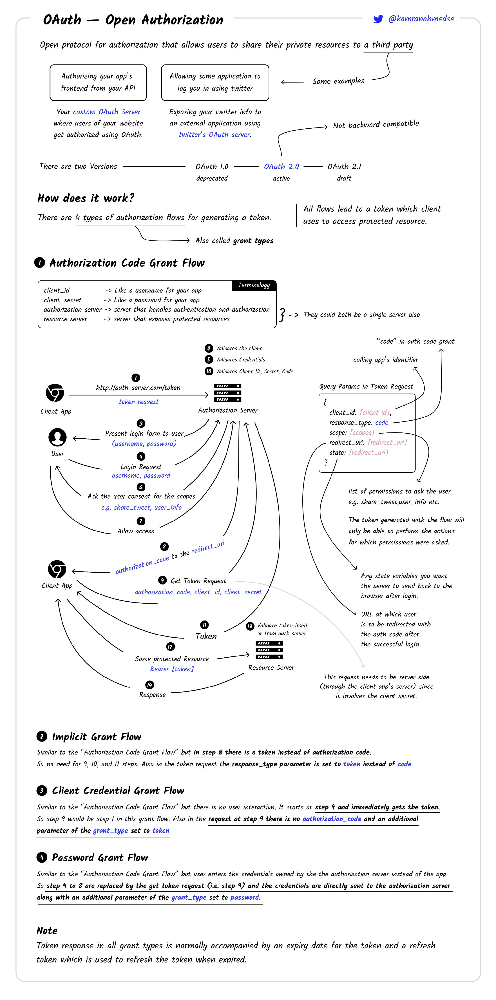

# OAuth

允許第三方應用，存取用戶的資訊，而不需提供帳號密碼。

[Google Sign-In JavaScript client reference](https://developers.google.com/identity/sign-in/web/reference)

### gapi.auth2.getAuthInstance()

Returns the GoogleAuth object.

```js
let GoogleAuth = gapi.auth2.getAuthInstance();
```

<br />


reference: [https://twitter.com/kamranahmedse/status/1276994010423361540](https://twitter.com/kamranahmedse/status/1276994010423361540)

## JWT | Json Web Token

將 data 以 base64 格式編碼，並以 `.` 做分隔

`Header` . `Payload` . `Signature`

Header(標頭): 用來指定 hash algorithm(預設為 HMAC SHA256)

Payload(內容): 可以放一些自己要傳遞的資料

Signature(簽名): 為簽名檢查碼用，會有一個 serect string 來做一個字串簽署

[https://jwt.io/](https://jwt.io/)

<br />

### Reference:

OAuth 2.0 筆記

https://blog.yorkxin.org/2013/09/30/oauth2-1-introduction.html

<br />

用JWT取代傳統 Session 來驗證使用者身份

https://ithelp.ithome.com.tw/articles/10196759
