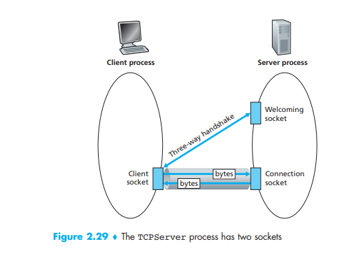

# 基礎知識

 

## Three-way Handshake | 三向交握

*https://notfalse.net/7/three-way-handshake*

SYN包：請求建立連接的數據包

ACK包：回應數據包，表示接收到了對方的某個數據包

實際上socket是對TCP/IP協議的封裝，Socket本身並不是協議，而是一個調用接口(API)

 

## 其他實現多人連線的 SDK

### Photon Engine | 光子引擎

[https://www.photonengine.com/zh-TW/Photon](https://www.photonengine.com/zh-TW/Photon)
