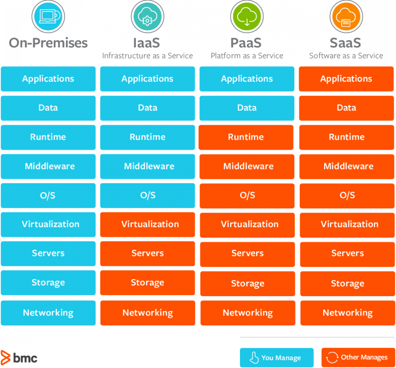
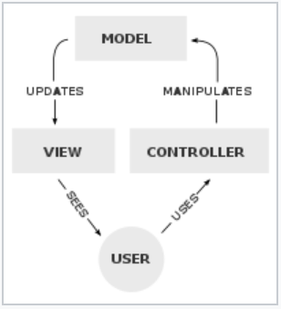
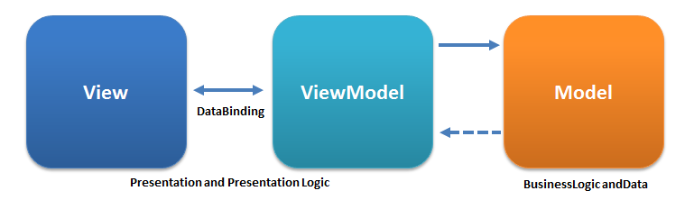

[<< Software Design](../software-design)

# Architectural Pattern | 架構模式

 

## Layered Architecture

分層架構

Layer              | 分層
------------------ | -----
Presentation Layer | 表現層，用戶介面
Business Layer     | 業務層，業務邏輯
Persistence Layer  | 持久層，提供數據
Database Layer     | 資料庫，保存數據

 

## Event-Driven Architecture

事件驅動架構

> Variations in event-driven architecture： 
> http://radar.oreilly.com/2015/02/variations-in-event-driven-architecture.html

 

## Microkernel Architecture

微核架構

 

## Microservices Architecture

微服務架構

 

## Cloud Architecture

雲架構

## Infrastructure

基礎建設 | infra

 

 

## SaaS

Software as a Service

常見的即是 cloud application services

## PaaS

Platform as a Service

## IaaS

Infrastructure as a Service

 

## Common Examples of SaaS, PaaS, & IaaS

Platform Type | Common Examples
------------- | ---------------
SaaS          | Google Apps, Dropbox
PaaS          | AWS Elastic Beanstalk, Windows Azure, Heroku, Google App Engine, Apache Stratos
IaaS          | AWS, Cisco Metapod, Microsoft Azure, Google Compute Engine (GCE)

Reference

https://www.bmc.com/blogs/saas-vs-paas-vs-iaas-whats-the-difference-and-how-to-choose/

 

### reference
> 软件架构入门 - 阮一峰： 
> http://www.ruanyifeng.com/blog/2016/09/software-architecture.html

 

## MVC 

Model–View–Controller

**Model**

處理資料及業務邏輯，接受 Controller 的事件並處理，將結果更新給已註冊的 View 層。

**View**

將資料呈現在畫面上，並向 Model 層註冊，監聽資料的更新。

**Controller**

負責處理訊息(來自User、Server、Client...)，並轉發給 Model 層或 View 層處理。

 

## MVVM

Model–View–ViewModel

**Model**

資料層。

**View**

將資料呈現在畫面上。與 ViewModel 層做雙向綁定，接受 ViewModel 層的資料，將操作訊息，傳遞給 ViewModel 層。

**ViewModel**

接受 Model 層的資料，將顯示邏輯傳給 View 層。接受 View 層的事件，並處理業務邏輯。

與 Model 層之間負責處理業務邏輯，與 View 層之間負責處理顯示邏輯。

 

