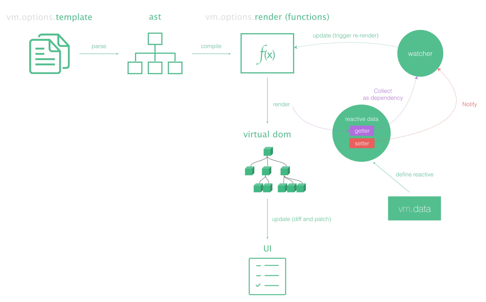

# VueJS

 

## Lifecycle

https://vuejs.org/v2/guide/instance.html

## Render Function

https://www.w3cplus.com/vue/vue-render-function.html

 

## vue.mixin

 

## [Component](https://github.com/krmfla/vue-template/blob/master/component.md)

 

## [Vue Router, Vue-CLI](https://github.com/krmfla/vue-template)
